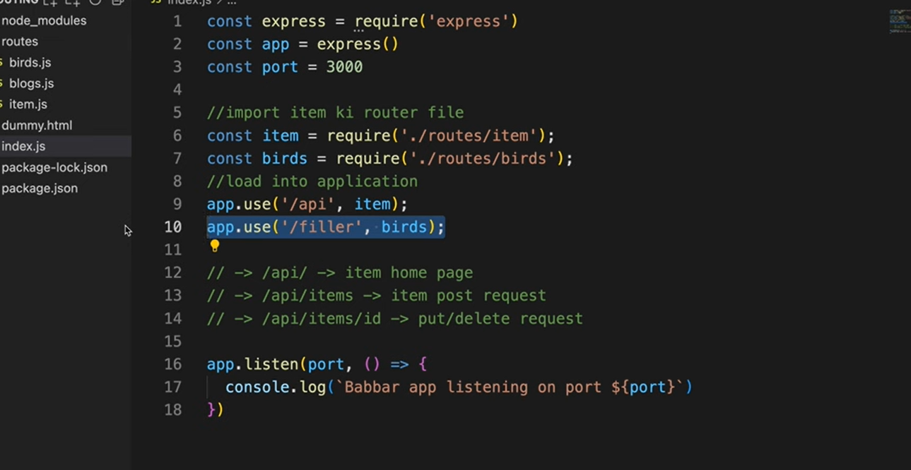

nodejs provide the the run time environment to run the js ie to to run js on server side

express js is a framework to write the efficient backend 

npm init
npm install express
npm install nodemon to auto refresh  then under pakkage.json under script add  "dev" : "nodemon xyz.js"

or add 

{
  "name": "second",
  "version": "1.0.0",
  "description": "",
  "license": "ISC",
  "author": "",
  "type": "commonjs",
  "main": "index.js",
  "scripts": {
    "dev": "nodemon index.js",
    "start": "node index.js",
    "test": "echo \"Error: no test specified\" && exit 1"
  },
  "dependencies": {
    "express": "^5.2.1",
    "nodemon": "^3.1.11"
  }
}

to run-> npm run dev

